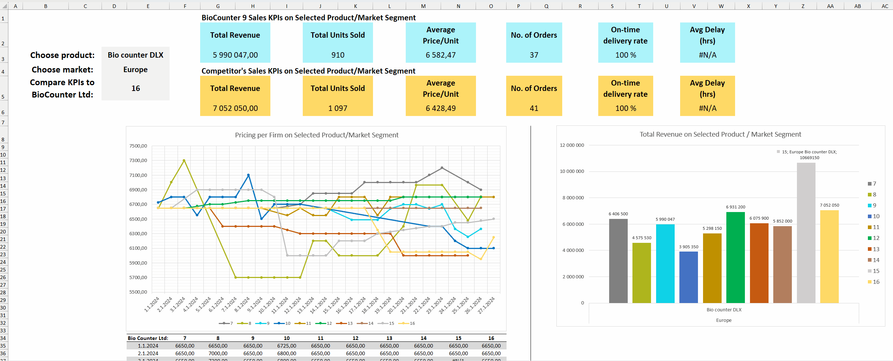
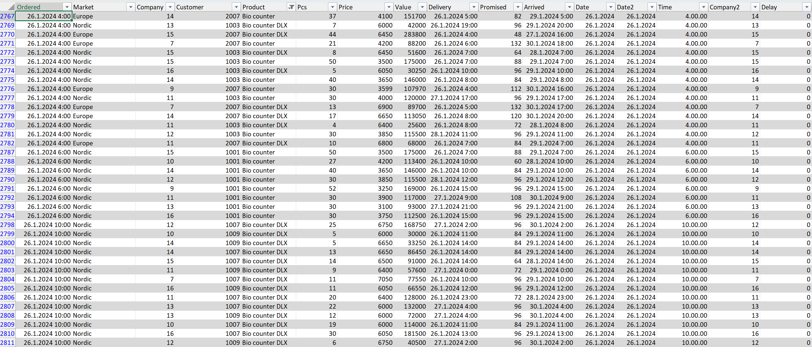

# Dynamic Sales Analytics Dashboard (Excel + VBA)

Download the file: [Click here to download the Excel-workbook](https://github.com/mikaelkankaanpaa/analytics-portfolio/raw/refs/heads/main/2-excel-VBA-dashboard/custom-vba-example.xlsm) *[Note, that full functionality requires enabling macros for the file: right-click the downloaded file -> Properties -> General: Security -> select 'Unblock']*

## Dashboard Overview

An interactive Excel dashboard for competitor and segment-level sales analysis, built on transactional simulation data ([Realgame](https://www.realgame.fi/)). It is a small excerpt from analysis associated with the course "Business Decisions and Market Analytics", which was structured around the RealGame simulation.  

The workbook transforms raw exports into a navigable analytics interface with dynamic filtering, KPI/competitor comparison, and automated visual updates.

## What it does

- Filters sales data by product and market via dropdown selectors
- Calculates segment-level KPIs:
  - Total revenue
  - Units sold  
  - Average price  
  - Number of orders  
  - On-time delivery rate  
  - Average delay  
- Enables side-by-side comparison against selected competitors
- Updates PivotCharts and time-series visuals dynamically
- Synchronizes KPI tile colors with chart series automatically

## How it works

- Structured transaction data imported to Excel (uses a subset of data; approx. 3000 rows)
- PivotTables & functions aggregate revenue, volume, pricing, and delivery metrics
- VBA event listener triggers automation when selectors change
- Pivot filtering implemented programmatically (Data Model–compatible)
- Font contrast adjusted dynamically for readability
- Programmatic resizing and rerendering of a normal Excel-chart

## The starting point - raw data used

## Tools Used

Excel, VBA (event-driven automation), Pivot Tables & Pivot Charts, Data Model, Functions
