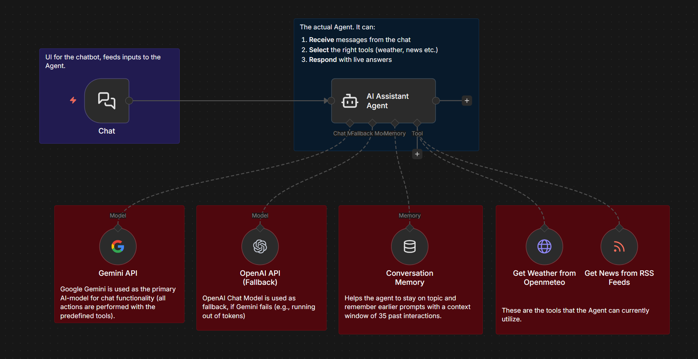
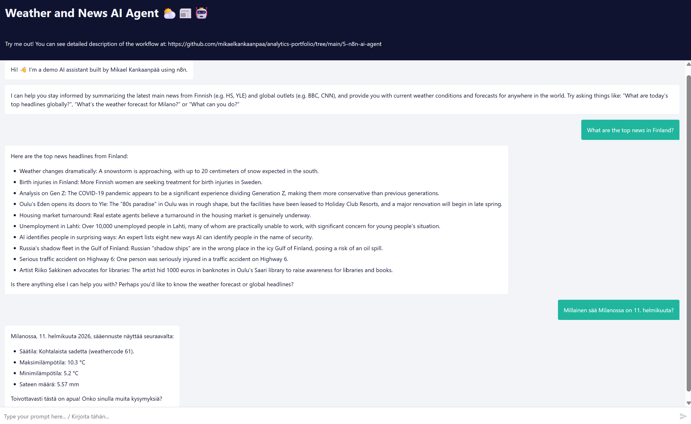

# News & Weather AI Assistant with n8n

*Try it yourself online*: [n8n Cloud Webhook](https://mikaelkankaanpaa.app.n8n.cloud/webhook/e5616171-e3b5-4c39-81d4-67409f9fa60a/chat) 

## Workflow Overview

## What it does
- Responds to natural-language questions via a chat interface
- Fetches and summarizes news from RSS feeds (Helsingin Sanomat, YLE, CNN, BBC)
- Provides current weather conditions and forecasts via an external API (Openmeteo)
- Uses an AI agent to select tools dynamically based on user inputs from the chat

## How it works
- Chat interface acts as trigger for the workflow and provides inputs to the agent 
- AI Agent node handles conversation and reasoning (Google Gemini-based, OpenAI as fallback)
- RSS and weather APIs are exposed as tools
- n8n orchestrates tool calls and response formatting

## Chat Example

!

## Tools Used
n8n, Google LLM (Gemini & OpenAI) APIs, RSS feeds, Weather API, Webhooks
